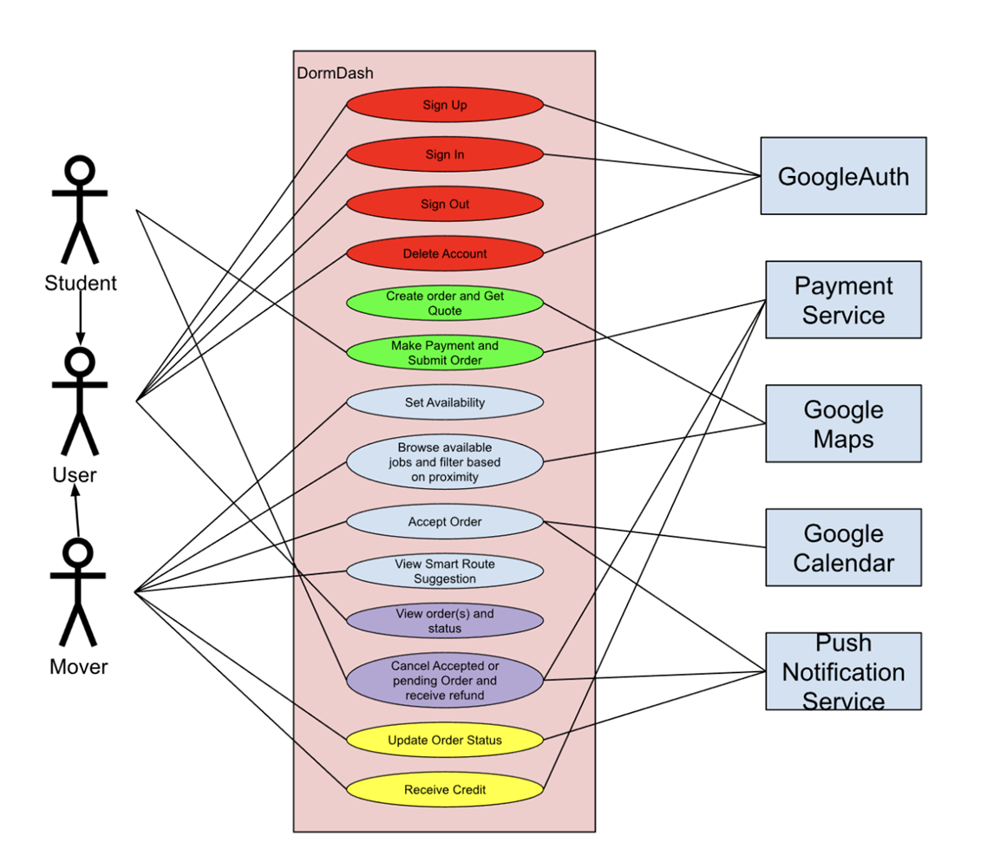
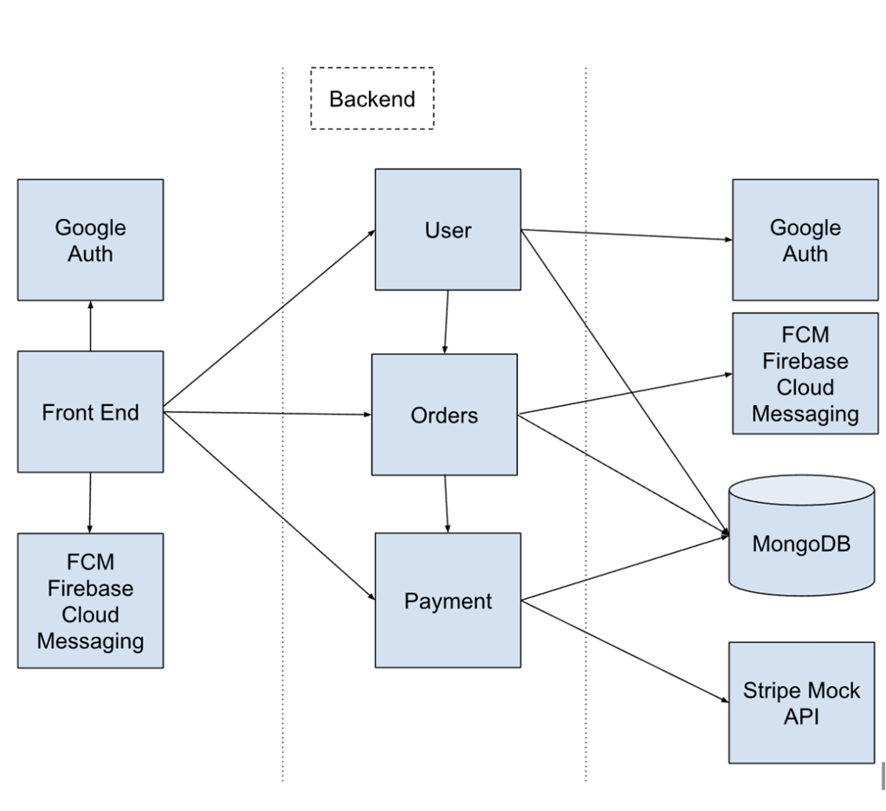

# Requirements and Design

## 1. Change History

| **Change Date**   | **Modified Sections** | **Rationale** |
| ----------------- | --------------------- | ------------- |
| _Nothing to show_ |

---

## 2. Project Description

Students living in dorms often struggle with limited space and the hassle of moving or storing personal belongings. Seasonal room changes, summer breaks, or even short-term needs like storing sports gear or bulky items create recurring challenges. Right now, students usually have to arrange storage themselves, which means finding a place that balances price and convenience, coordinating transportation, and dealing with storage durations that rarely match their needs. This process is time-consuming, stressful, and often more expensive than necessary.

DormDash provides a complete, stress-free solution. Through an Uber-like app, students can request “movers” who will pick up, transport, and securely store their belongings in company-managed storage facilities—so students never have to worry about finding or arranging a storage location themselves. Items can be stored for exactly the amount of time needed, tracked through the app, and scheduled for return on a chosen date, when movers will deliver them directly to the specified location. With two modes—one for students using the service and one for movers—DormDash makes the entire moving and storage experience seamless, reliable, and tailored to student life.

---

## 3.1 List of Project Features

1. **Authenticate**  
   Users (students and movers) can sign up, log in, log out, and delete their profile using Google Auth0.  

2. **Place Request**  
   Students can schedule a pickup and return date, receive a price quote, make a payment, and track the status of their request to see if it's been placed successfully, if it's still pending, or if a mover has accepted it.  

3. **Find Job**  
   Movers can view available jobs, filter based on time/location, accept or decline jobs, and update job status (e.g., en route, completed).  

4. **Manage Requests**  
   Students can track their stored items in real time and cancel their request before a mover begins pickup, with refunds issued automatically when applicable.  

5. **Update and Complete Requests**  
   Movers can update the status of a request based on their progress, and they can also cancel it. After completion, movers can receive credit for fulfilling the request.  

---

### **3.2. Use Case Diagram**

### **3.3. Actors Description**
1. **Student**: Requests pickup/return, pays, views order status.
2. **Mover**: Browses/accepts jobs, completes pickup/return.
3. **Payment Service**: Manages student payment and routes credits.
4. **Maps service**: Used for proximity filtering and price quoting
5. **Calendar service**: Used for scheduling orders, after acceptance.
6. **Push notification service**: Used to send notifications to students based on order status updates.

### **3.4. Use Case Description**
- Use cases for feature 1: Authenticate
1. **Sign up**: Register user credentials with GoogleAuth.
2. **Sign in**: Use GoogleAuth to confirm credentials and authenticate them.
3. **Sign out**: Use GoogleAuth to mark credentials as unauthenticated.
4. **Delete account**: Delete all traces of the account.

- Use cases for feature 2: Create and Submit Order  
1. **Create order and get a quote**: The student enters addresses, pickup & return times, and volume. The system validates addresses, computes a quote based on pre-set values & distances, and returns a price quote with a breakdown.  
2. **Submit order & pay**: The student confirms the quote and makes a payment. The system creates pickup/return jobs and publishes them to the job pool.  

- Use cases for feature 3: Find Jobs  
1. **Set availability (mover)**: The mover defines weekly time blocks where they are available to complete pickup orders. The system uses these constraints to determine which jobs are eligible to be shown to the mover.  
2. **Browse and filter available jobs**: The mover views jobs that are unassigned within their schedule and filters them by parameters such as volume of boxes, payout, etc. The system returns a ranked list that fits the mover’s constraints.  
3. **View smart route suggestion**: Provides the mover with an optimal route (a list of jobs to accept) that maximizes earnings within the location they are heading to, with consecutive orders along the same path.  
4. **Accept order**: The mover accepts an unassigned job, and the system atomically assigns it. Both parties receive a Google Calendar invite for the job time, and the student is notified that their order has been accepted.  

- Use cases for feature 4: Handle Orders  
1. **View orders & statuses**: Students and movers can both view their order details (date, boxes, and location) and the status of the order.  
   - For students: They can see if a mover has accepted, if the mover has left, arrival time, and when items are stored.  
   - For movers: They can see if the order is on schedule, if it was canceled, and when it is complete.  
2. **Cancel order and get refund**: The student can cancel an order that is pending or assigned (but not yet picked up) and receive a refund subject to timing/policy.  

- Use cases for feature 5: Track and Complete Order  
1. **Update job status**: The mover advances a job through the lifecycle (e.g., On the way → Arrived → Picked up → In storage → Out for delivery → Completed) or cancels the order they have accepted. The system persists the status of the order and pushes real-time updates to the student.  
2. **Receive credit**: After the mover has completed the order, the system credits the mover with their payout. The mover can see the credit reflected in their profile earnings page.  

### **3.5. Formal Use Case Specifications (5 Most Major Use Cases)**

#### Use Case 1: Create Order and Get Price Quote

**Description**: The student specifies their requirements by entering items’ size, pickup & return times, and address. The system validates inputs and calculates a quote using pricing rules.

**Primary actor(s)**: Student   
**Preconditions**: Student authenticated, app can reach maps  
**Postconditions:** A quote with breakdown is displayed 
    
**Main success scenario**:
1. Student opens “New order”
2. System displays field for pickup/return addresses & time windows, and item volume 
3. System validates required fields, and converts addresses using geocoding.
4. System computes distance, and applies pricing rules (base+ per-km, volume, time, taxes)
5. System shows the quote with a cost breakdown

**Failure scenario(s)**:
- 3a. One or more required fields are missing or invalid
    - 3a1. System highlights missing/invalid field with inline error messages and remains on the form

- 4a. Address cannot be validated
    - 4b1. System shows “address not recognized” and returns to step 3
            

#### Use Case 2: Submit Order and Make Payment

**Description**: The student commits to the price quote, makes a payment, and submits one order containing two parts – pickup and return. The system records payment, creates the order, and publishes the two jobs to the job pool.  

**Primary actor(s)**: Student  
**Preconditions**: Student authenticated, valid quote exists (see Use Case 1), payment method available  
**Postconditions**: Order with two “jobs” created in status *Requested*; payment is charged, calendar events for the student are created, jobs are visible in the movers’ job pool  

**Main success scenario**:  
1. Student reviews the quote and taps “Submit Order”  
2. System requests payment for the total  
3. System creates the order and two jobs (pickup, return) with scheduled windows  
4. System publishes both jobs to the movers’ available job pool  
5. System shows the new order in “My Orders” with status *Requested*  

**Failure scenario(s)**:  
- 3a. Payment authorization fails  
  - 3a1. System shows the decline reason and allows retry or changing payment method  
- 3b. Order creation fails  
  - 3b1. System cancels the order and informs the student  
  - 3b2. Rollback payment (void/refund)  
  - 3b3. Return to step 1  
- 4a. Job publishing fails  
  - 4a1. System keeps order and flags it for retry  

#### Use Case 3: Find Jobs

**Description**: A mover can specify availability, browse open jobs, and filter them by proximity, time, or price. Movers can also accept a smart route suggestion.  

**Primary actor(s)**: Mover  
**Preconditions**: Mover is authenticated  
**Postconditions**: A filtered list is presented, and the mover can open a job to view details  

**Main success scenario**:  
1. Mover navigates to “View Orders”  
2. Mover uses Google Calendar to specify availability  
3. System displays all unassigned orders in the current window of availability  
4. Mover can apply filters  
5. System updates job list based on currently selected filters  
6. Mover can open a job to view details (distance, time, earnings)  
7. Mover may proceed to **Accept Order** (see Use Case 4)  

**Failure scenario(s)**:  
- 3a. No available unassigned jobs fit the mover’s schedule  
  - 3a1. Display message: “No jobs available within your schedule”  
- 5a. No jobs match the applied filters  
  - 5a1. Display message: “No jobs available currently. Try broadening filters.”  

#### Use Case 4: Accept Order

**Description**: A mover views available jobs and accepts a job (pickup or return). The system assigns the mover, updates status, creates calendar events for both parties, and notifies the student.  

**Primary actor(s)**: Mover, Student  
**Preconditions**: Mover is authenticated and has set availability; job is currently unassigned  
**Postconditions**: Job is assigned to the mover and status changed to *Assigned*; calendar events for both mover and student exist; student is notified  

**Main success scenario**:  
1. Mover opens “Available Jobs”  
2. System shows jobs that match mover availability, optionally filtered  
3. Mover opens a job and taps “Accept”  
4. System performs checks and assigns the job, updating status to *Assigned*  
5. System creates calendar events for both parties  
6. System sends a notification to the student confirming assignment and expected arrival window  
7. Mover sees the job listed under “My Jobs”  

**Failure scenario(s)**:  
- 4a. Another mover accepted the job first  
  - 4a1. System informs the mover the job is no longer available and refreshes the list  
- 4b. Conflict with existing mover event  
  - 4b1. System denies acceptance with conflict message  
  - 4b2. Prompt mover to pick a different job  

#### Use Case 5: Smart Route Suggestion

**Description**: A mover can view an optimized route of orders that maximizes their gain.  

**Primary actor(s)**: Mover  
**Preconditions**: Mover is authenticated and their schedule is specified  
**Postconditions**: Mover views and accepts or declines smart route suggestion  

**Main success scenario**:  
1. Mover opens “Available Jobs”  
2. Mover specifies their availability  
3. Mover clicks on “Smart Route Suggestion” button and views the optimal route  
4. Mover can accept all, some, or decline suggestions  

**Failure scenario(s)**:  
- 2a. No available jobs fit the mover’s schedule  
  - 2a1. Mover is prompted to change their schedule  

### **3.6. Non Functional Requirements:**

1. **Scalability**  
   - **Description**: Handle short, predictable bursts around move-in/move-out while remaining simple enough for a student-built deployment.  
   - **Parameters**: Support ~400 concurrent users and ~200 jobs/day during peak weeks.  
   - **Justification**: UBC Vancouver alone has ~60k students, so even low adoption during peak periods can create bursts. In late April’s “Great Shuffle,” UBC reports ~7,000 residence moves in Vancouver (~9,100 system-wide including UBCO) within a single week. Designing for ~400 concurrent users and ~200 jobs/day offers conservative headroom without requiring complex infrastructure.  

2. **Availability**  
   - **Description**: Ensure responsiveness and reliability of core interactions.  
   - **Parameters**: 95% of requests on core calls (job list, accept, order status) should reflect within 0.1s.  
   - **Justification**: Research on usability response times shows that sub-0.1s feedback feels instantaneous to users, improving trust and engagement ([Nielsen Norman Group](https://www.nngroup.com/articles/response-times-3-important-limits/)).  

## 4. Designs Specification
### **4.1. Main Components**
1. **Users**
    - **Purpose**: Represent the end user (student) who schedules pickups/returns, pays, and tracks order status.
    - **Interfaces**: 
        1. Orders
            - **Purpose**: Create orders, view their statuses, request returns.
        2. Google Calendar
            - **Purpose**: Receive event reminders for scheduled pickups/returns.
        3. Google Maps
            - **Purpose**: Validate addresses and estimate distances to calculate price.
        4. Payments
            - **Purpose**: Pay for submitted orders.

2. **Payments**
   - **Purpose**: Handle student payments and route credits to movers.  
   - **Interfaces**:  
     1. **Student**  
        - **Purpose**: When orders are created or cancelled, process payments or refunds.  
     2. **Mover**  
        - **Purpose**: When orders are completed, route credits to movers; handle reversals if orders are cancelled.  

3. **Orders**
   - **Purpose**: Central domain component that creates and tracks pickup/return orders and coordinates acceptance and state transitions.  
   - **Interfaces**:  
     1. **Student**  
        - **Purpose**: Create, edit, and view orders.  
     2. **Mover**  
        - **Purpose**: Accept jobs and update order status throughout the lifecycle.  

### **4.2. Databases**

1. **MongoDB**  
   - **Purpose**: Store flexible, document-oriented data for students, movers, orders, and job states. Orders and their lifecycle events can be modeled as nested documents, making it easier to track status updates, storage details, and histories without complex joins.  

### **4.3. External Modules**
1. **Identity** 
    - **Purpose**: Google OAuth (OIDC) for login.
2. **Calendar**
    - **Purpose**: Google Calendar for event creation/updates after job acceptance.
3. **Maps**  
   - **Purpose**: Google Maps (Geocoding + Distance Matrix) for address normalization and proximity filtering.  

4. **Payments**  
   - **Purpose**: Stripe (or Square) for tokenized payments and webhooks; no card data is stored on our servers.  

**Rationale**: These APIs are well-documented, widely used, student-friendly, and provide free tiers along with robust SDKs.  

### **4.4. Frameworks**

1. **TypeScript + NodeJS (Backend)**  
   - **Purpose**: Provide a strongly typed, event-driven runtime for our application API.  
   - **Reason**: Required by this class.  

2. **Kotlin + Android Studio (Frontend)**  
   - **Purpose**: Build the user interface for our application.  
   - **Reason**: Required by this class.  

### **4.5. Dependencies Diagram**

<!-- 

### **4.6. Use Case Sequence Diagram (5 Most Major Use Cases)**
1. [**[WRITE_NAME_HERE]**](#uc1)\
[SEQUENCE_DIAGRAM_HERE]
2. ...

### **4.7. Design and Ways to Test Non-Functional Requirements**
1. [**[WRITE_NAME_HERE]**](#nfr1)
    - **Validation**: ...
2. ...

--!>
