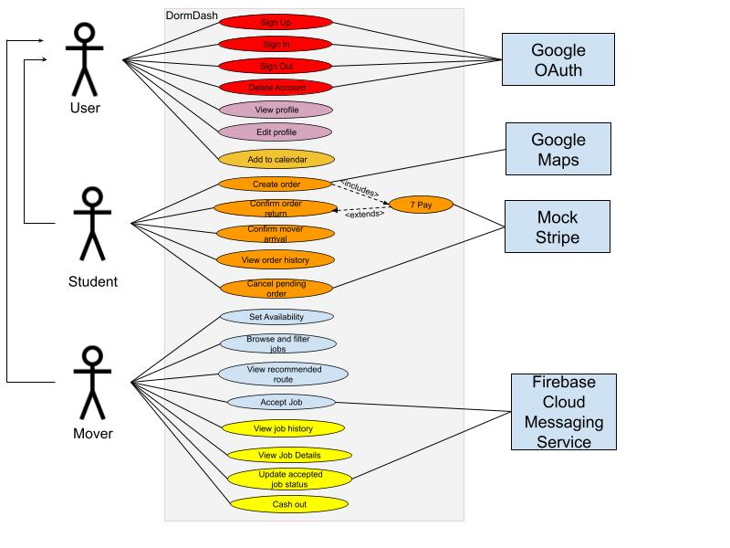
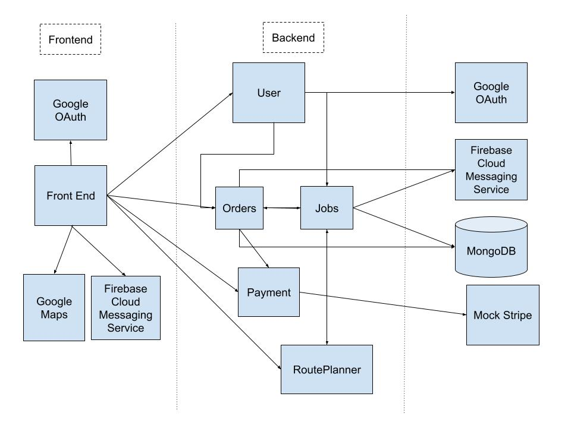

# Requirements and Design

## 1. Change History

| **Change Date** | **Modified Sections** | **Rationale**                                                                                                                                                                                                                                                           |
|----------------| --------------------- |-------------------------------------------------------------------------------------------------------------------------------------------------------------------------------------------------------------------------------------------------------------------------|
| 2025-10-21     | Requirements Specification: Functional Requirements: Features | We changed our feature names to match their use cases, and created new use cases. Why: To have a more logically organized formal specification of our features.                                                                                                         |
| 2025-10-21     | Requirements Specification: Functional Requirements: Use Cases | We changed the names, descriptions, and success scenarios of our use cases and the actors involved. Why: To match the reality of our actual implementation of the features.                                                                                             | 
| 2025-10-21     | Requirements Specification: Use Case Diagram | Changed our use case diagram to match the new use cases. Why: To ensure consistency throughout our requirements specification.                                                                                                                                          |
| 2025-10-22     | Requirements Specification: Formal Use Case Specification | Updated the formal use case specifications according to the new feature/use case descriptions. Why: To reflect our changes and keep consistent definitions for our use cases.                                                                                           |
| 2025-10-22     | Requirements Specification: Actor Descriptions | Changed external service names. Why: To keep the naming consistent.                                                                                                                                                                                                     |
| 2025-10-22     | Requirements Specification: Non-Functional Requirements | Changed our second non-functional requirement to a UI response requirement. Why: This is a more specific constraint and better reflects our implementation choices.                                                                                                     |
| 2025-10-22     | Design | Added Jobs component and RoutePlanner component to the design description and diagram. Why: Jobs were added because orders are a two-phase service (storage and return); RoutePlanner was separated out to follow separation of concerns and encapsulate routing logic. |

---

## 2. Project Description

Students living in dorms often struggle with limited space and the hassle of moving or storing personal belongings. Seasonal room changes, summer breaks, or even short-term needs like storing sports gear or bulky items create recurring challenges. Right now, students usually have to arrange storage themselves, which means finding a place that balances price and convenience, coordinating transportation, and dealing with storage durations that rarely match their needs. This process is time-consuming, stressful, and often more expensive than necessary.

DormDash provides a complete, stress-free solution. Through an Uber-like app, students can request “movers” who will pick up, transport, and securely store their belongings in company-managed storage facilities—so students never have to worry about finding or arranging a storage location themselves. Items can be stored for exactly the amount of time needed, tracked through the app, and scheduled for return on a chosen date, when movers will deliver them directly to the specified location. With two modes—one for students using the service and one for movers—DormDash makes the entire moving and storage experience seamless, reliable, and tailored to student life.

---

## 3.1 List of Project Features

1. **Authenticate**  
   Users (students and movers) can sign up, sign in, and sign out using Google OAuth. 

2. **Manage Profile**  
   Users can view and edit their profile details (name, profile picture and bio). 

3. **Manage Orders**  
   Students can use the storage service by creating an order: in which they specify a pickup and expected return date, receive a price quote, make a payment, and track the status of their order if it's been placed successfully,or if it's still pending or if a mover has accepted the order. If the order is accepted, the student can add a calendar event with the order details to their google calendar. Once the mover picks up their items, the student is prompted to confirm that their order has been picked up. If the order status is currently in storage, students can confirm the return job, if they have passed the expected return date they will pay the extra difference. If they are requesting a return before the expected return date, they are given a partial refund. Students can track their stored items in real time and cancel their current active order request before a mover accepts it, with refunds issued automatically.

4. **Find Jobs**  
   Movers can view available jobs, filter based on time, and have the option to accept jobs. Movers can also view a recommended route suggestion, which is an optimized chain of orders. Movers can accept some, or all of the orders in the suggestion. 

5. **Manage Accepted Jobs and Earnings**  
   Movers can view details of jobs they have accepted including active and completed jobs. Movers can update the status of an active job based on their progress (when they have arrived at the student’s pickup location or at the storage warehouse, etc.). This will result in a live update for the student whose order is associated with the job. After completing an active job, movers receive credit for completing the order. Movers can view details of all completed jobs, and mock transferring their earnings to their personal account.

6. **Add to Calendar**  
   Movers can add accepted jobs (storage or return phase) timings to their calendar. Students can add accepted orders’ ( in their storage or return phase ) timings to their calendar.

---

### **3.2. Use Case Diagram**

### **3.3. Actors Description**
1. **Student**: Creates storage order (pickup or return), pays, views order status, confirms when mover has arrived to pickup/deliver their items.
2. **Mover**: Browses/accepts jobs, completes pickup/return jobs, can cash out earnings.
3. **User**: Embodies an entity whose actions are shared by both student and mover. This includes authentication use cases, managing profile and adding 
4. **Mock Stripe**: Manages student payment and routes refunds back to their card. 
5. **Google Maps**: Used for address geocoding to get a price quote and to validate addresses are within serviced area (Greater Vancouver).
6. **Firebase Cloud Messaging Service**: Used to send notifications to students when the status of their order changes and when the mover has arrived to pickup or return their items.
7. **Google OAuth**: Used to create authentication tokens for users and verify existing ones.

### **3.4. Use Case Description**

- **Use cases for feature 1: Authenticate**  
  1. **Sign up**: User can register an account with a role (student or mover).  
  2. **Sign in**: User can initiate an active session and access their account.  
  3. **Sign out**: User can terminate an active session.  
  4. **Delete Account**: User can delete their account in DormDash.

- **Use cases for feature 2: Manage Profile**  
  1. **Edit Profile**: Users can view the name, profile picture, and bio associated with their account  
  2. **View Profile**:  Users can edit the name, profile picture, and bio associated with their account 

- **Use cases for feature 3: Manage Orders**  
  1. **Create order**: The student enters addresses, pickup & expected return times, and volume of their items. The system validates the address is within the Greater Vancouver area, and returns a price quote with a breakdown. The student can pay and submit their order.  
  2. **Pay**: The student can pay for the quote they received which is the last step to create a successful order. A storage job is created (return job is created in the Confirm Return use case), and published to the job pool for the mover to view.  
  3. **Confirm Return**: If the current active order’s status is in-storage, students can schedule a return job, if they have passed the expected return date they will pay the extra difference. If they are requesting a return before the expected return date, they are given a partial refund.  
  4. **Confirm Mover Arrival**: When the mover picks up the student’s items from the pickup address or drops it off to their drop-off address, the student is prompted to confirm that their order has been picked up or dropped off, before the mover can update the order status any further (acts as a 2 way handshake between student and mover).  
  5. **View order history**: Students can view details of their past orders or their current active order. Details they can view include pickup/dropoff dates, address and volume of items, and the status of the order.  
  6. **Cancel pending order**: Students can cancel an order which is pending and receive a refund subject to refund policy. 

- **Use cases for feature 4: Find jobs**  
  1. **Set Availability**: The mover defines daily time periods for each day of the week where they are available to complete pick up orders. The system uses these slots to determine which jobs are eligible to be shown to mover if they choose to only view jobs within their availability.  
  2. **Browse and filter jobs**: The mover views jobs that are unassigned and they can filter based on their availability if they want to only see jobs within the availability they specified.  
  3. **Accept Job**: The mover accepts an unassigned job, then the system atomically assigns it and displays it in the “Current Jobs” page. The student is notified that their order has been accepted and a real time update is triggered for the student showing the new status of their order as Accepted.  
  4. **View recommended route**: The mover can view an recommended optimal route within the duration of time they are available for and depending on their current location. A list of jobs is suggested which maximizes their possible earnings which are on the way to each other. Movers can accept some or all of the jobs.

- **Use cases for feature 5: Manage Accepted Jobs and Earnings**  
  1. **View Job Details**: The mover views details of an active job they’ve accepted (pickup address, return address, status, volume, and scheduled time).  
  2. **View Job History**:  
     The mover views a record of all previously completed jobs, including date, location, volume, and earnings. This gives movers visibility into their performance and history.  
  3. **Update Accepted Job Status**:  
     The mover updates the status of a job. The system validates transitions and updates the student’s view in real-time. Mover receives credits upon job completion.  
  4. **Cash Out**:  
     The mover requests to withdraw accumulated earnings. The system calculates the balance available, deducts pending payouts if necessary, and mocks initiating a transfer to the mover’s connected account.

- **Use cases for feature 6: Add to Calendar**  
  1. **Add to Calendar**: The student can add confirmed and accepted orders’ dates to their calendar. The mover can add schedules date/time of any of their accepted jobs to their calendar.

### **3.5. Formal Use Case Specifications (5 Most Major Use Cases)**

#### Use Case 1:

**ID:** UC-1

**Title:** Create Order 

**Description:** The student enters addresses, pickup & expected return times, and volume of their items. The student submits their order. The system creates the order, publishes a storage job to the job pool.

**Primary actor(s):** Student, Google Maps

**Preconditions:** Student authenticated, app can reach Google Maps 

**Postconditions:** Order is successfully created with status “Pending confirmation" and is visible for the student, job is visible in the movers’ job pool
    
**Main success scenario**:

1. Student clicks “Create New Order” button
2. System displays auto-complete text field for address
3. Student enters the pick up address.
4. System suggests a list of valid addresses matching student input using Google Maps
5. Student selects address by clicking on the suggestion and clicks on “Get Base Delivery Charge” button
6. System displays two date picker field for pickup/return dates, +/- buttons to adjust the hour and 15 minute time intervals for the pickup/return time, and +/- buttons for the number of small, medium, large boxes. 
7. Student enters both time fields, dates and number of boxes.
8. System displays price quote
9. Student can view price breakdown by clicking “Show Breakdown” hidden field and clicks “Proceed to Payment” button
10. Execute ‘UC-2 Pay’ use case successfully
11. Order is placed and the system displays the order status, details, and pin showing pick up address using Google Maps.

**Failure scenario(s)**:
- 5a. Student enters address outside of Greater Vancouver area
   - 5a1. System displays error message: “We currently only service Greater Vancouver.” and continues to display address input field.
-  7a. Student inputs a return date or time which is before the pickup date or time 
   - 7a1. System displays error: “Return date/time must be after pickup date/time” and stays on the form.

—

#### Use Case 2:

**ID:** UC-2

**Title:** Pay

**Description:** The student commits to the price quote, and makes a payment.

**Primary actor(s):** Student, Mock Stripe 

**Preconditions:**  Student authenticated, has clicked “Proceed to Payment” button (see UC-1), payment method available

**Postconditions:** Payment is charged
    
**Main success scenario**:

1. System displays order summary, drop down field for Payment Method, and text fields for Full Name, and Email Address.
2. Student enters details and clicks “Process Payment” button
3. System displays pop-up showing summary of entered fields
4. Student confirms details and clicks “Confirm & Pay” button
5. System carries out payment using Mock Stripe and returns successful payment to the caller

**Failure scenario(s)**:
- 4a. Payment fails
   - 4a1. System shows the decline reason and allows retry or changing payment method

—

#### Use Case 3:

**ID:** UC-3

**Title:** Browse and filter jobs

**Description:** A mover can browse unassigned jobs and filter them by availability if they want to see only the jobs within their availability. 

**Primary actor(s):** Mover

**Preconditions:** Mover is authenticated

**Postconditions:** A list of unassigned jobs is presented, which the mover can accept.
    
**Main success scenario**:

1. Mover clicks on “Find Jobs” on the navigation bar on the bottom of the home page.
2. System displays all unassigned jobs including the pickup, drop-off addresses, volume of items, date and time, the type of job (storage or return) and the credit they can earn from the job. 
3. Mover can click toggle to switch jobs displayed from “Show All” to “Within Availability”
4. System displays unassigned jobs only within mover’s availability time windows 
5. Mover can optionally accept the job (see UC-4 “Accept Job” use case)

**Failure scenario(s)**:
- 2a. No unassigned jobs exist 
   - 2a1. Display to mover that there are no jobs available
- 4a. No unassigned jobs exist within mover’s availability 
   - 4a1. Display to mover that there are no jobs available currently with suggestion to broaden their availability

---

#### Use Case 4:

**ID:** UC-4

**Title:** Accept Job 

**Description:** A mover can accept an unassigned job which can be of two types: pickup (from student to storage), or return (from storage to student). The job gets assigned to the mover. 

**Primary actor(s):** Mover, Firebase Cloud Messaging Service

**Preconditions:**  Mover is authenticated job is currently unassigned, and browses and filters jobs by carrying out UC-3. 

**Postconditions:** Job is assigned to the mover who can view the job in “Current Jobs” screen and the student is notified. 
    
**Main success scenario**:
1. Mover clicks on “Accept” for the corresponding job they’d like to accept.
2. System assigns the job to the mover, Firebase Cloud Messaging Service notifies the student who created the order that it has been accepted, and a live update occurs for the student’s order status.
3. Mover sees the job listed under “Current Jobs” 

**Failure scenario(s)**:
-  4a. Another mover accepted job first
   - 4a1. System refreshes the list and the job is no longer visible.

—

#### Use Case 5:

**ID:** UC-5

**Title:** View Recommended Route

**Description:**  Mover can view a route of orders which maximizes the amount of credits they can earn within a specified amount of time (duration of shift) based on their current location.

**Primary actor(s):** Mover

**Preconditions:** Mover is authenticated, their availability is specified, and they are on “Find Jobs” page 

**Postconditions:** Mover can view the recommended route and accepts some or all of the jobs suggested.

**Main success scenario**:
1. Mover clicks on “Get Optimal Route” button
2. System prompts mover for their desired max shift duration
3. Mover enters their max duration by choosing one option from the multiple choice list and clicks “Find Smart Route” button
4. System prompts mover to allow access to their current location
5. Mover allows access to location by pressing “Only this time” or “While using the app” button
6. System displays a route summary and a list of jobs within the mover’s availability and maximum duration window, with details of the pickup address, travel time and credits. 
7. Mover can accept all (using “Accept all jobs” button) or some of the suggested jobs (“Accept job” button)

**Failure scenario(s)**:
- 5a. Mover does not allow access to location
	- 5a1. Display that location permission is required with suggestion to grant permission
- 6a. Unable to suggest route due to mover’s chosen duration or availability
	- 6a1. Mover is prompted to change their availability and/or their duration windows.

### **3.6. Non Functional Requirements:**

1. **Scalability**  
   - **Description**: Handle short, predictable bursts around move-in/move-out while remaining simple enough for a student-built deployment.  
   - **Parameters**: Support ~400 concurrent users and ~200 jobs/day during peak weeks.  
   - **Justification**: UBC Vancouver alone has ~60k students, so even low adoption during peak periods can create bursts. In late April’s “Great Shuffle,” UBC reports ~7,000 residence moves in Vancouver (~9,100 system-wide including UBCO) within a single week. Designing for ~400 concurrent users and ~200 jobs/day offers conservative headroom without requiring complex infrastructure.  

2. **UI Response Time**  
   - **Description**: Ensure responsiveness and reliability of UI interactions.  
   - **Parameters**: We want to support 95% of requests to reflect onto the UI within 0.1s of change (e.g. job list updates on job creation, order creation creates jobs for movers to see, etc.) 
   - **Justification**: Research on usability response times shows that sub-0.1s feedback feels instantaneous to users, improving trust and engagement ([Nielsen Norman Group](https://www.nngroup.com/articles/response-times-3-important-limits/)).  

### **4. Designs Specification**
### **4.1. Main Components**
1. **Users**
    - **Purpose**: Represent the end users: student who creates pickups/return order, pays, and tracks order status or mover, who accepts jobs, updates job status and earns credit. 
    - **Interfaces**: 
        1. 
            - **Purpose**: 
        2. 
            - **Purpose**: 
        3.  
            - **Purpose**: 
        4. 
            - **Purpose**: 

2. **Payments**
   - **Purpose**: Handle student payments and route credits to movers.  
   - **Interfaces**:  
        1. 
            - **Purpose**: 
        2. 
            - **Purpose**: 
        3.  
            - **Purpose**: 
        4. 
            - **Purpose**: 

3. **Orders**
   - **Purpose**: Central domain component that creates and tracks pickup and return orders, generates corresponding storage/return jobs, and handles state transitions.  
   - **Interfaces**:  
        1.    
            - **Purpose**: 
        2. 
            - **Purpose**: 
        3.  
            - **Purpose**: 
        4. 
            - **Purpose**: 

4. **Jobs**
   - **Purpose**: Component that handles job status updates, creates storage or return jobs, and coordinates job assignment and acceptance.
   - **Interfaces**:
        1.    
            - **Purpose**: 
        2. 
            - **Purpose**: 
        3.  
            - **Purpose**: 
        4. 
            - **Purpose**: 

5. **RoutePlanner**
   - **Purpose**: Handles creation of optimized routes for movers to maximize efficiency and earnings.
   - **Interfaces**:
        1.    
            - **Purpose**: 
        2. 
            - **Purpose**: 
        3.  
            - **Purpose**: 
        4. 
            - **Purpose**: 

### **4.2. Databases**

1. **MongoDB**  
   - **Purpose**: Store flexible, document-oriented data for students, movers, orders, and job states. Orders, jobs and their lifecycle events can be modeled as nested documents, making it easier to track status updates, storage details, and histories without complex joins.  

### **4.3. External Modules**

   1. **Google OAuth**  
      - **Purpose**: For login, issuing and verifying ID/access tokens. No passwords stored on our servers; verify ID tokens server-side and cache public keys.

   2. **Google Maps**  
      - **Purpose**: Provides APIs (Places Autocomplete, Geocoding) for address normalization, geocoding, service-area validation.

   3. **Mock Stripe**  
      - **Purpose**: For tokenized payments, payment intents, refunds and webhook notifications. We never store raw card data; keep scope minimal by using test/mock mode.

   4. **Firebase Cloud Messaging Service**  
      - **Purpose**: Firebase Cloud Messaging (FCM) for push notifications about order/job status changes and mover arrival alerts.  

   **Rationale**: These providers are well-documented, commonly used in student projects, provide generous free tiers and SDKs.

### **4.4. Frameworks**

1. **Express.js**  
- **Purpose**: Minimal and flexible Node.js web application framework that provides robust features for building REST APIs.
- **Reason**: Industry-standard for Node.js backends with extensive middleware ecosystem and simple routing

2. **Socket.IO**  
- **Purpose**: Enables real-time, bidirectional communication between clients and server using WebSockets.
- **Reason**: Pushes live job acceptance and status updates to students; handles reconnection automatically.

3. **jsonwebtoken**  
- **Purpose**: Library for creating and verifying JSON Web Tokens (JWTs).
- **Reason**: Used for token-based authentication and authorization

4. **google-auth-library**  
- **Purpose**: Used to validate Google OAuth ID tokens
- **Reason**: Official library, so using it means we don’t manually implement token validation or risk accepting spoofed tokens.

5. **Mongoose**  
- **Purpose**: MongoDB object modeling library providing schema-based data validation.
- **Reason**: Simplifies MongoDB interactions with schema definitions, built-in validation, query building, and middleware hooks. Makes database operations more maintainable and type-safe.

6. **Zod**  
- **Purpose**: TypeScript-first schema validation library.
- **Reason**: Validates request bodies, query parameters, and API inputs at runtime. 

7. **Multer**  
- **Purpose**: Middleware for handling multipart/form-data for file uploads.
- **Reason**: Processes image uploads from users 

8. **Retrofit**  
- **Purpose**: Type-safe HTTP client for Android and Java.
- **Reason**: Simplifies REST API communication with the backend. Automatically serializes/deserializes JSON, handles request/response mapping, and provides clean interface-based API definitions.

9. **OkHttp**  
- **Purpose**: OkHttp is the underlying HTTP engine used by Retrofit. It handles connections, timeouts, retries, and interceptors.
- **Reason**:   Handles connection pooling, request retries, and interceptors for adding authentication headers. Provides reliable network communication with automatic response caching.

10. **Jetpack Compose (UI framework)**  
   - **Purpose**: Modern declarative UI toolkit for building native Android interfaces.
   - **Reason**: Required by course. Reduces boilerplate and simplifies state management compared to XML layouts

11. **Material Design 3**  
   - **Purpose**: Google's latest design system providing pre-built UI components with consistent styling.
   - **Reason**: Ensures professional, accessible UI with ready-to-use component

12. **Compose Navigation**  
   - **Purpose**: Type-safe navigation library for Jetpack Compose applications.
   - **Reason**: Manages screen transitions, deep linking, and back stack with minimal code.

13. **Hilt**  
   - **Purpose**: Dependency injection framework built on top of Dagger for Android.
   - **Reason**: Automates object creation and lifecycle management, improving testability and reducing boilerplate.

14. **Gson**  
   - **Purpose**: JSON serialization/deserialization library by Google.
   - **Reason**: Converts JSON responses from the backend into Kotlin data classes automatically. Works seamlessly with Retrofit for parsing API responses.

15. **Maps Compose**  
   - **Purpose**: Jetpack Compose integration for Google Maps SDK.
   - **Reason**:  Displays interactive maps showing pickup/delivery locations in a Compose-native way. Allows students to see current order locations and movers to see job addresses on a map.

16. **Coil**  
   - **Purpose**: Image loading library optimized for Jetpack Compose.
   - **Reason**:  Efficiently loads and caches images (user profile pictures)

### **4.5. Dependencies Diagram**

### **4.6. Use Case Sequence Diagram (5 Most Major Use Cases)**
1. [**[WRITE_NAME_HERE]**](#uc1)\
[SEQUENCE_DIAGRAM_HERE]
2. ...

### **4.7. Design and Ways to Test Non-Functional Requirements**
1. [**[WRITE_NAME_HERE]**](#nfr1)
    - **Validation**: ...
2. ...

